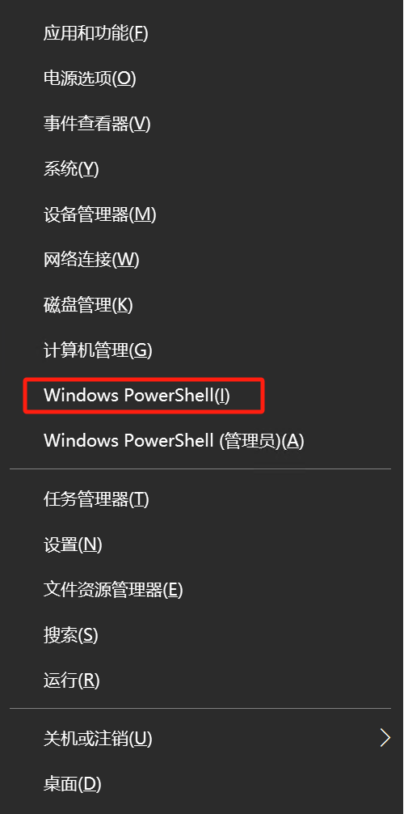
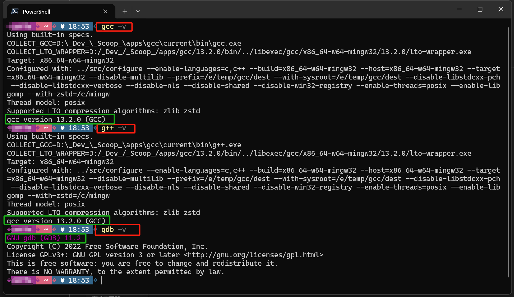

# 《C/C++ 运行环境安装配置指南——初学者极简版》

如何 **安装 C/C++ 编译环境**，来自：**《C/C++ 新手避坑指南 系列》**

+ 龙爸写给**初学 C/C++** 的朋友们的**新手避坑指南**，扫平入门的几个大障碍的**极简教程**。

原文发布、维护于龙爸**陪孩子学习 `Python`、`C++` 的练习项目**:

- [龙爸个人网站1](https://coffeedrunk.cn/archives/Cpp_Beginner_Guide)| [Github](https://github.com/LoongBa/Cpp_Beginner_Guide) 国外 | [GitCode](https://gitcode.com/LoongBa/Cpp_Beginner_Guide) 国内 | [Gitee](https://gitee.com/LoongBa/Cpp_Beginner_Guide) 国内 | [龙爸个人网站2](https://loongba.cn/archives/Cpp_Beginner_Guide)

- 欢迎意见、建议和帮助，谢谢 🥰💕❤️

- 如果对你有帮助，请支持 Star~ ✨✨✨

- 转载时请保留声明和出处，谢谢 🤝🤝🤝

- 如果是 `Github`、`MarkText`、`PDF` 等，请打开目录方便阅读 😎

---

## 为何编写此指南？——全网最简、最新

此指南主要目的是用**尽可能极简**的方式，帮助初学者**完成 C/C++ 的基础环境搭建**，<mark> 两步搞定 </mark>。

——**尤其是小学生小朋友**😘🥰🤗

好多家长朋友很头疼，孩子在学习 `C/C++` 的第一步遇到的各种问题不知道怎么解决，例如：

+ 有的是培训机构给了一个比较**老旧**的安装包，勉勉强强弄了能用，却**隐藏了各种问题**；

+ 有的是按照某个教程非常复杂却**走不通**，要么下载遇到问题，要么注册环境变量遇到问题；

+ 网络上大部分教程【互相借鉴】内容都差不多，不仅很复杂还有大量**过时信息或者错误信息**。

通过此指南，**用尽可能简单的方式**，指导初学者 **<u>两步完成</u> C/C++ 的编译器、调试器的下载，安装、配置和更新**。

> 本教程不同于其它教程，相对更加简单，也不容易出现意外。

> 但因为面向小学生、初中生小朋友，所以详细步骤会比较详细，请根据自身情况适当快进。  
> 本教程仅针对 `Windows 10/11` ，没有测试 `Windows 7/XP`，也不考虑 `MacOS`、`Linux` 等系统。

现有的几乎所有教程都写的比较复杂，尽量选择较新的学习，因为版本更新后一些配置可能变化了或者不需要了。


**很多教程的方法比较复杂的原因：**

> 下载安装 `MinGW64` 或 `Cygwin` 或 `msys2`，下载经常遇到问题，安装、**设置系统环境变量**复杂。

**本教程简化之处**：

+ **用 `Scoop` 自动下载、安装** `GNU` 的 `gcc/g++/gdb`，不需要通过类似上面的三个应用或者其它应用；

+ **用 `Scoop` 自动设置系统环境变量**，**省去了复杂的设置操作**；

+ **后续可以用 `Scoop` 随时更新到最新版本**。

+ 未来还会用到 `Scoop` ，方便获取其它开发工具。

虽然还有一种更简单的安装方式：先安装第三方开发的 VSCode 扩展，用它来完成配置。

——**龙爸不推荐**，因为本方法虽然简化，但**知其所以然**。

——本文的方法虽简单，但**没有跳过、遗漏**应该掌握的基本操作，只纠正了错误、采用了不同的方法。

---

## 1. 在线安装 Scoop

### 1.1. 运行终端

有很多种方法，这里只说最简单的：

在 `Windows 10/11` 中，按下 `Win + x` 键，在弹出菜单里选中：`终端`（不要选 `终端管理员`）或 `Windows Powershell`

 

左边是 Win11， 右边是 Win10。

### 1.2. 在线安装 Scoop

随后在打开的`终端（命令行）界面`，复制粘贴下面几行命令并按回车（ `#` 后面是注释）：

> ```powershell
> # 设置 Powershell 的用户策略，如果提示确认请选择 'Y'
> Set-ExecutionPolicy -ExecutionPolicy RemoteSigned -Scope CurrentUser
> # 这里用国内镜像代替了官方的安装地址
> iwr -useb https://gitee.com/glsnames/scoop-installer/raw/master/bin/install.ps1 | iex
> # 安装 git
> scoop install git
> # 更新一下 scoop 自己的脚本和数据，执行后稍微等一等就好
> scoop update
> ```

**可能**会看到类似的提示：

> 执行策略更改
> 执行策略可帮助你防止执行不信任的脚本。更改执行策略可能会产生安全风险，如 https:/go.microsoft.com/fwlink/?LinkID=135170
> 中的 about_Execution_Policies 帮助主题所述。是否要更改执行策略?
> [Y] 是(Y)  [A] 全是(A)  [N] 否(N)  [L] 全否(L)  [S] 暂停(S)  [?] 帮助 (默认值为“N”): **<mark>y</mark>**

**——输入 `Y`，同意执行后续脚本。**

没有什么意外的话，进度条唰唰唰的过，稍微等一等就能看到提示完成后续安装。

用 `Scoop` 来安装一些开发常用的工具非常方便，以后会经常用到。

※ `Scoop` 功能非常强大，远远不止这一点点，建议**以后有空多了解一下**。

> `Scoop` 是一款适用于 `Windows` 系统的 `命令行软件（包）管理工具`，免费、开源：[官网](https://scoop.sh/)、`Github` [开源项目地址](https://link.zhihu.com/?target=https%3A//github.com/ScoopInstaller/Scoop)。
> 
> 简单来说，就是可以通过命令行工具（`PowerShell`、`CMD` 等）实现软件（包）的安装管理等需求，
> **通过简单的一行代码实现软件的下载、安装、卸载、更新等操作**。
> 
> 其灵感来源于`macOS` 的 `Homebrew` [开源项目地址](https://github.com/Homebrew/brew)，`Mac` 用户就比较熟悉了。
> 
> `Scoop` 不仅可用于安装软件包，还可以更新、批量更新，甚至导出安装列表，重装系统后一次性批量安装。
> 支持很多常用软件，包括 `VSCode`、钉钉、微信等，比如**最强视频音频编码解码**工具：`ffmpeg`。
> 
> 尤其**对于开发人员而言**，更方便安装指定版本、安装多个版本、运行指定版本，在很多情况下非常有用。

### 1.3. 正常安装跳过此步：切换为国内镜像

**※※※ 按照本教程的方式，不需要此步 ※※※**

`Scoop` 默认情况下连接到 [`Github.com`](https://Github.com) 来获取相应的更新数据等等，因为国内访问 [`Github.com`](https://Github.com) 不稳定，切换为国内镜像会比较方便一些。

**——仅当：你之前 用官方的方式安装过** `Scoop`，可以用下面命令切换为国内镜像：

```powershell
# 配置仓库为国内镜像，感谢 Scoop 团队，感谢国内镜像提供者
scoop config SCOOP_REPO https://gitee.com/glsnames/scoop-installer
# 配置主桶为国内镜像
cd $env:SCOOP\buckets\Main
git remote set-url origin https://gitee.com/scoop-bucket/main.git
```

> 感谢 Scoop 团队，感谢国内镜像提供者👍❤️💕

后面会推荐访问 `Github.com` 的工具 `FastGithub`，虽然**访问速度不快**但至少**能访问**。

--- 

## 2. 一键自动下载、安装、设置 gcc, gdb

随后，用 `Scoop` 帮助我们自动下载安装 `GNU` 的 `C/C++ 编译器和调试器`：`gcc`, `gdb`——`g++` 已经包含在 `gcc` 里。

在 `终端（命令行）界面` 粘贴或输入下面命令：

```powershell
# 先装一个下载工具（可以跳过）
scoop install aria2
# 安装 gcc gdb
scoop install gcc gdb
```

这个过程中，`Scoop` 会自动安装所需的 `7zip`，不需要设置环境变量等等，因为 `Scoop` 已经**自动完成**了。

> `aria2` 是一个开源下载工具，可以跳过 `aria2`
> 
> 上面的命令，也可以合并在一行：
> 
> scoop install aria2 gcc gdb

---

## 3. 可选：测试一下，确保安装正确

分别运行测试一下，在 `终端（命令行）界面` 中分别执行下面的命令：

```powershell
gcc -v
g++ -v
gdb -v
```

如果安装失败，则会提示找不到对应的命令，如：

> gcc: The term 'gcc' is not recognized as a name of a cmdlet, function, script file, or executable program.
> Check the spelling of the name, or if a path was included, verify that the path is correct and try again.

安装正确的情况下，在每个命令输出中能看到提示和版本号，如图中绿色部分：



---

## 4. 可选扩展：后续可能用到的

### 4.1. 更新已经安装的软件包

同样，以后可以在 `终端（命令行）界面` 中执行下面的命令，**更新所有安装了的工具包**：

```powershell
# 第一次会自动安装 git
scoop update *
```

也可以**仅更新特定的软件包**：

```powershell
# 可选，查看安装了哪些工具包
scoop list
# 更新特定的软件包，支持多个
scoop update git gcc gdb
```

### 4.2 可选：下载、解压缩、运行 Fastgithub.UI

后续学习中，经常需要访问 [`Github.com`](https://Github.com)，然而国内访问 [`Github.com`](https://Github.com) 经常不稳定。

如果这时候总是提示网络问题，可以用开源、免费的 `FastGithub` 工具。

因为**<u><span>项目原作者已经删库</span></u>**，下面是众多备份之一：托管在国外 [`Github.com`](https://Github.com)

> 源代码项目地址: [<u><span>GitHub - WangGithubUser/FastGitHub: GitHub加速神器，解决GitHub打不开、用户头像无法加载、Releases无法上传下载、git-clone、git-pull、git-push失败等问题</span></u>](https://github.com/WangGithubUser/FastGitHub)  
> 最新 `2.15` 版的压缩包国外下载：[<u><span>fastgithub_win-x64.zip</span></u>](https://github.com/WangGithubUser/FastGitHub/releases/download/v2.1.5/fastgithub_win-x64.zip)

当然，可能现在还无法稳定访问 [`Github.com`](https://Github.com)，下面是托管在国内的不同备份：

> [Gitee.com](https://Gitee.com)：[uid/FastGithub]([<u><span>FastGithub: FastGithub</span></u>](https://gitee.com/uid/FastGithub))  
> `2.14` 版国内直接下载地址： [<u><span>fastgithub_win-x64.zip</span></u>](https://gitee.com/uid/FastGithub/releases/download/2.1.4/fastgithub_win-x64.zip)<u><br></u>GitC[ode.com](https://ode.com): 多个备份 [GitCode - 全球开发者的开源社区,开源代码托管平台](https://gitcode.com/search?q=fastgithub&type=repo)

使用方式：

> 解压缩到本地文件夹，双击运行其中的 `FastGithub.UI.exe`

然后访问一下 `Github.com` 上的页面试试看，例如：

> 爱学习的龙爸 https://github.com/loongba

看到下面的实时流量统计图，说明已经起作用了：


很多文章中也会推荐其它类似 `FastGithub` 的工具，如 `Steam++` 等，相比之下 `FastGithub` 属于<mark> 最简单、功能单一 </mark>的一个。
——推测因为与 `Steam++` 等利益相关（有广告），`FastGithub` 原作者删除了原来在 `Github` 上的项目，

但幸好有喜欢这个工具的其它朋友备份并继续维护着 `FastGithub`，所以**上面分享的并不是原作者的项目地址，而是备份项目地址**。并且在原项目基础上略做了改进和修改了 bug。

**感谢原作者，也感谢这些热心的备份者和维护者（还有很多类似备份）**，**谢谢你们** 👍❤️💕

> 注意：`FastGithub` 工具可以配置为系统服务，在 `Windows` 启动时自动运行，
> 
> 这里暂不展开，有兴趣可自行查阅其项目说明，如运行原理、源代码等等。

<u>请注意作者的 **免责声明**</u>：

> - **fastgithub 不具备“翻墙”功能,也没有相关的计划**
> - **fastgithub 不支持Windows7等已被发行方停止支持的操作系统，并且也不会主动提供支持**
> - **fastgithub 不能为您的游戏加速**
> - **fastgithub 没有主动在github之外的任何渠道发布**

---

# 下一步：安装 VSCode，配置中文语言包、C/C++ 扩展

有了 C/C++ 编译器、调试器，接下来用什么样的代码编辑软件？

有很多选择，仅推荐免费、开源的 `VSCode`——`Visual Studio Code`。

龙爸继续肝，熬夜用若干头发换了一份极简教程：《C/C++ 新手避坑指南》之二

《**极简安装配置 VSCode：C/C++扩展、中文乱码**》

+ [龙爸个人网站1](https://coffeedrunk.cn/archives/Cpp_Beginner_Guide)| [Github](https://github.com/LoongBa/Cpp_Beginner_Guide) 国外 | [GitCode](https://gitcode.com/LoongBa/Cpp_Beginner_Guide) 国内 | [Gitee](https://gitee.com/LoongBa/Cpp_Beginner_Guide) 国内 | [龙爸个人网站2](https://loongba.cn/archives/Cpp_Beginner_Guide)
