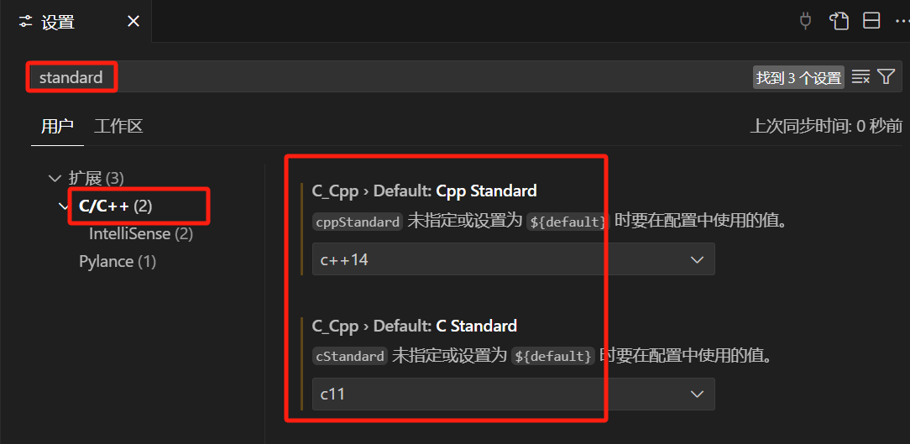

# 《极简配置 VSCode：中文语言包、C/C++扩展、launch.json、task.json》

> **用 VSCode 写你的第一个 Hello World**，
> 
> 最简单的方法配置 `VSCode` 最麻烦的 `launch.json` 和 `task.json`。

来自：**《C/C++ 新手避坑指南 系列》**

- 龙爸写给**初学 C/C++** 的朋友们的**新手避坑指南**，扫平入门的几个大障碍的**极简教程**。

原文发布、维护于龙爸**陪孩子学习 `Python`、`C++` 、`算法入门` 的练习项目**:

- [龙爸个人网站1](https://coffeedrunk.cn/archives/Cpp_Beginner_Guide)| [Github](https://github.com/LoongBa/Cpp_Beginner_Guide) 国外 | [GitCode](https://gitcode.com/LoongBa/Cpp_Beginner_Guide) 国内 | [Gitee](https://gitee.com/LoongBa/Cpp_Beginner_Guide) 国内 | [龙爸个人网站2](https://loongba.cn/archives/Cpp_Beginner_Guide)

- 欢迎意见、建议和帮助，谢谢 🥰💕❤️

- 如果对你有帮助，请支持 Star~ ✨✨✨

- 转载时请保留声明和出处，谢谢 🤝🤝🤝

- 如果是 `Github`、`MarkText`、`PDF` 等，请打开目录方便阅读 😎

---

# 极简配置 VSCode：中文、C/C++扩展、中文乱码

> 因为面向中小学生朋友，所以详细步骤会比较详细，请根据自身情况适当快进。  
> 本教程仅针对 `Windows 10/11` ，没有测试 `Windows 7/XP`，也不考虑 `MacOS`、`Linux` 等系统。

现有的几乎所有教程都写的比较复杂，尽量选择较新的学习，因为版本更新后一些配置可能变化了或者不需要了。

**很多教程的方法比较复杂的原因：**

> 上一步，安装配置 `C/C++` 编译环境的尾巴没有处理好；
> 
> 安装 `VSCode` 之后，需要配置 `tasks.json`、`launch.json` 等等，比较复杂；

**本教程简化和特别之处**：

> - 结合上一步的正确设置，不需要额外配置；
> 
> - 调整了 `VSCode` 的配置顺序，自动安装必备扩展，简化操作；
> 
> - `VSCode` 自动配置了 `tasks.json`、`launch.json`；
> 
> - 一键编译、调试、运行，默认不会出现中文乱码；
> 
> - 目前全网**唯一极简**、**唯一正确解决中文乱码**：正确分析原因，找到正确方法。

虽然还有更简单的安装方式：先安装第三方开发的 VSCode 扩展，用它来完成配置。

——**龙爸不推荐**，因为本方法虽然简化，但**知其所以然**。

——本文的方法虽简单，但**没有跳过、遗漏**应该掌握的基本操作。

---

# 1. 前言

## 1.1 什么是代码编辑软件

编写代码，大牛、神人可以用记事本等`文本编辑软件`写代码，普通人使用专门为编程设计的`代码编辑软件`。

> `代码编辑软件`是一种用于编写和编辑代码的工具。
> 
> 它的主要功能是为开发者提供一个方便的文本编辑环境，支持代码的输入、修改、格式化等操作。

`代码编辑软件` 有很多，其中功能相对比较全面、强大的，带有编译、调试、源代码管理甚至项目管理和团队协作等等的，称为 `集成开发环境（IDE，Integrated Development Environment）`。

`集成开发环境 IDE` 也有很多优秀的产品，其中比较著名和被广泛使用的主要有`微软公司` 的`VSCode` 和 `JetBrains 公司`的 `CLion`。

对于初学者，推荐用**开源、免费**的`微软公司`  `VSCode`（全称：`Visual Studio Code`）。

## 1.2 代码编辑软件与编译器是什么关系？

`编译器`是一种将高级编程语言（如 C、C++、Java 等）转换为机器语言（或中间语言）的工具软件。它的主要功能是将人类可读的代码转换为计算机可以执行的代码。

- **代码编辑软件**：也称为“`代码编辑器`”，主要负责代码的输入、编辑和格式化，不涉及代码的执行。

- **编译器**：主要负责将代码转换为可执行文件，不涉及代码的编辑。

为了方便编译、运行和调试，代码编辑软件一般具有调用编译器和调试器的功能。

但它们仍然是两种独立的工具软件，各自专注于不同的任务。

并且，设计开发一个编译器的要求，远远高于设计开发一个代码编辑软件。

所以，一般由专业的开源社区，或者商业软件团队在持续开发和维护着不同的编译器软件。

例如主流的 `C/C++` 编译器：

- 开源编译器 `GCC (GNU Compiler Collection)`是一个广泛使用的开源编译器套件，支持多种编程语言，包括 `C/C++`。`GCC` 以其高度的可移植性和强大的优化功能而闻名。
- 开源编译器 `Clang` 是另一个流行的开源 `C/C++` 编译器，它是 `LLVM 项目` 的一部分。`Clang` 以其快速的编译速度和友好的错误信息而受到开发者的喜爱。
- 商业编译器 `MSVC (Microsoft Visual C++)` 是微软提供的 `C/C++` 编译器，它是 `Visual Studio 集成开发环境` 的一部分。`MSVC` 提供了与 `Windows` 平台紧密集成的优化和调试工具。

综上，不同的`代码编辑软件`、`集成开发环境 IDE 软件` 往往可以<mark>搭配不同的</mark>`编译器`来进行工作。

## 1.3 为何推荐的不是 `Dev C++`？

早年的开发工具还没那么成熟、好用，`Dev C++` 解决了初学者难以上手的问题，

> 集成了 MinGW 编译器、GDB 调试器和 AStyle 格式整理器等工具，支持代码高亮、语法检查、调试等功能

关键它是开源项目，避免了商业授权的额外费用。

> 也就是说，更加强大而专业并且方便的不免费，免费的不够方便和足够强大。

**然而，现在早已不存在这些问题。**

最近十来年里，涌现出很多开源、免费的代码编辑器甚至集成开发环境 IDE，已经非常强大并且方便。

机构和学校主要在用 `Dev C++`，一则 `Dev C++` 的确方便——少了很多麻烦；二则是“惯性”（说白了是跟不上行业发展）。

——龙爸为何选择、推荐 `VSCode` ？

+ 为了<mark>**我儿子学编程**</mark>，

+ **必然选<mark>有利于学习</mark>的，<mark>而不是对我、对他而言 最省事的</mark>。**

**何况，NOI/CSP 竞赛要求里很清楚写明可以使用 `Visual Code`。**

> 当然，现实中就是出现了比赛现场没有 `VSCode` 的情况😂
> 
> ——赛前专门问过，答复是：不确定，但会按官方规则准备。
> 
> ——草台班子就是草台班子。浪费一次机会和报名费，更好地认识了世界的运行本质也不错。
> 
> 不过没关系，能力高自然可以`向下兼容`。

## 1.4 哪种代码编辑器更好？

如果要问`哪种 IDE 更好`？好比问`哪种编程语言最好`？

软件行业有一个流行的梗：`PHP 是世界上最好的编程语言`。

> 貌似，现在而言 `Python 是世界上最好的编程语言`吧 🐶

对于初学者而言，重要的是：

——不要被那些 “<mark>xx语言最好</mark>” 所误导，只有外行才会这么说。

# 2. 下载安装 VSCode

> **VSCode 官网：** [https://code.visualstudio.com/](https://code.visualstudio.com/)
> 
> 不记得没关系，浏览器输入 `VSCode` 搜索，地址与上面相同那一条就是官网了。
> 
> ——下载速度很快，不必从其它网站下载二手的。

注意选择 `64位、稳定版本`：


## 2.1. 运行安装，默认选择为当前用户安装

**建议不要安装到默认的 `C` 盘**，这里为了演示简化：

——**<mark> 路径中不要出现中文 </mark>**，避免以后可能遇到的一些莫名其妙的麻烦，不必要
（`GNU C/C++` 编译和调试器等等，对 `Windows` 和 中文环境的兼容性虽然已经很好了，但情况很复杂）


选中这两项方便一点：


## 2.2. 安装中文语言包

- 安装完成后，运行 `VSCode`，按下快捷键：`Ctrl-Shift-X` 打开 `Extensions`（扩展）——或者点左边工具栏积木方块样子的图标；

- 在顶部的搜索栏输入：`Chinese` 并稍等符合条件的扩展包列表加载，

- 选择下面的 `Chinese (Simplified) (简体中文) Language Pack for Visual Studio Code`，

- 选中并在右侧点击 `Install`，安装中文语言包扩展：


- 安装完成后，`VSCode` **右下角**会弹出消息提示 `更改语言并重新启动`，
  点击 `Change Language and Restart`，`VSCode` 自动重启后就是中文环境了。


## 2.3.（此步跳过，后面会自动安装）手动安装、配置 `C/C++` 扩展

很多教程都会有这一步，本教程在后面步骤会自动安装，此处跳过。


# 3. 编写、运行第一段 `C/C++` 代码

<mark>注意：</mark>**不要按照别的教程去配置 C/C++ 扩展、编译器等。**

## 3.1. 打开文件夹

在 `VSCode` 中选择一个文件夹来保存你的代码，例如：`D:\MyCode\Learn_C`

> 注意：<mark> 路径和文件名中不要带空格、中文 </mark>，避免后续编译、调试时无法预料的错误。
> 
> 目前测试发现，**中文路径和中文文件名**情况下，运行时正常，但调试时 `gdb` 出错。
> 
> ——查询资料后推测不是 `gdb` 的问题，初步判断是 `VSCode` 终端环境有差异，待深入排查。


## 3.2. 新建 C/C++ 文件

在 `VSCode` 左侧的`资源管理器`中，点右上角的 `新建文件`， 


并为创建的文件取个名字比如 `HelloWorld.c` 或 `HelloWorld.cpp`（不要用中文）,

——**不需要写入内容**


## 3.3. 自动安装扩展

`VSCode` 会自动识别扩展名，并启用对应编程语言的扩展。

稍等，注意右下角提示安装推荐的扩展包：


接受，等扩展安装完毕，然后<mark>【**重新运行 VSCode**】</mark>

——关闭 `VSCode`，再运行。

## 3.4. 第一段代码

重新运行 `VSCode` 后，在右侧编辑区域编写代码并保存（按 `Ctrl + S`）

不妨粘贴下方 `程序员打开数字世界的第一个魔法口令`：`Hello World!`

C 版：

```c
#include <stdio.h>
void main() {
  printf"Hello World!");
}
```

或 C++ 版：

```cpp
#include <iostream>
int main() {
  cout << "Hello World!";
  return 0;
}
```

## 3.5. 运行代码

点击编辑区域右上角这个长得像 `播放` 按钮的图标，运行和调试：


## 3.6. 自动配置 C/C++ 环境

`VSCode` 是一个通用的代码编辑器，默认并没有内置不同编程语言的编译器。

点了上一步的运行按钮之后，`VSCode` 会**自动提示配置编译器**，选中默认项：

——`VSCode` 会自动识别到之前安装过、并在 `Path` 环境变量配置过的 `gcc.exe` 或 `g++.exe`：

——这里注意：<mark> **上一步自动装好扩展后必须重启一下 VSCode** </mark>，否则 `VSCode` 可能会无法自动识别 `gcc`或 `g++`

> 这是个小 bug，可能未来某个版本就解决了。


+ **关闭右下角的提示**（来源为 `CMake Tools` 的提示——短期内用不上 `CMake`，有个印象就好）：
  
  

## 3.7. 自动产生任务配置文件

左侧`资源管理器`看到多了一个文件夹 `.vscode`、里面有两个文件：

- `.vscode`：`VSCode` 自动创建的用于存放配置文件的文件夹；
+ `launch.json` 和 `tasks.json`：运行配置和负责编译代码为可执行的 `exe` 文件的任务配置；
  
  ——正是其它教程需要手工配置的文件之一，这里**自动生成了**，**以后再深入学习**；

+ `helloWorld.exe`：`gcc/g++` 对你的代码进行编译生成的 `可执行文件`，调试、运行都离不开它。

后续，再深入研究如何修改这两个配置文件，**目前暂时跳过**。

## 3.8. 查看运行结果

在底部输出窗口 `终端` 能看到类似下面的运行结果：


**编译成功！运行成功！**

**说明 gcc/g++ 设置成功！**

> 注意，`.c` 扩展名文件使用 `gcc.exe` 编译；`.cpp` 扩展名文件使用 `g++.exe` 编译。
> 
> 后续，再配置 `C++ 编译器` 的标准，如 `NOI/CSP` 要求 `C++14`。

## 3.9. 运行和调试：试一下调试器 gdb

下拉菜单中选 `运行`，`VSCode` 会记住上一次的操作，以后不用每次都按旁边的下拉菜单来选择。

——运行和调试有什么区别？后续调试代码会用到：


已经了解调试的同学，可以加断点调试测试一下配置是否正常，代码会停在加了断点这一行，并等待处理：


**调试功能正常！`gdb` 设置成功！**

## 3.9 配置 C/C++ 编译标准

根据最新的规定，`NOI 系列活动`（包括 `CSP-J/S` 在内）中 `C++` 程序编译默认采用的语言标准为 **`C++14`**

> 官网：[关于NOI系列活动中编程语言使用限制的补充说明](https://www.noi.cn/gynoi/tlgd/2021-09-11/836159.shtml)
> 
> 原文：**除题面有明确要求外，C++程序编译默认采用的语言标准为C++14**

所以，接下来简单配置一下：

+ 按快捷键 `Ctrl - ,` 或者在 `文件` 菜单中 `首选项` - `设置`，打开设置界面；

+ 在顶部搜索框输入：`c/c++`，结果如下图：

+ 修改C++ 标准 `Cpp Standard` 为 `C++ 14`；关闭（自动保存配置）。



试运行前面的程序，**没有意外的话，顺利完成！**

# 4. 完事，推荐几个常用扩展

这时候装几个常用扩展（按照前面装语言包的方式）：

## 4.1 必装扩展：Error Lens

<mark> 必装扩展 </mark>：`Error Lens` ——在出错的代码旁显示错误信息，<mark> 方便定位错误位置 </mark>（默认在终端输出窗口）。
下面的例子中故意制造了一个错误：


## 4.2 必装扩展：Error Gutters

<mark> 必装扩展 </mark>：`Error Gutters`——配合上一个扩展，在警告、出错的代码前显示图标：


## 4.3 推荐扩展：`C/C++ Compile Run`

——编译、调试和运行 `C/C++` 代码的帮助扩展，**自动配置**已经安装的 `gcc/g++/gdb`

——快捷键：`F5` 编译、调试运行，`F6` 编译、运行

——其实有它，入门学习基本够用了，可以跳过以上所有步骤。 

## 4.4 推荐扩展：`Code Runner`

同上一个扩展，二选一即可（注意，不是另外一个 `C/C++ Runner`）

这个扩展相比上一个，优点是方便直接运行

——快捷键：`Ctrl + Alt + N`

这个扩展支持更多的语言，如 `Java`、`C#`、`Python` 等等，

龙爸因为同时在陪孩子学习 `Python` 所以装了这个扩展：


## 4.5 可选扩展：`Indent-Rainbow`

用彩虹色显示缩进，方便对齐——尤其在 `Python` 中非常有用；
类似的扩展，还有<u>彩虹括号</u>、<u>彩虹花括号</u>，但在这个扩展里已经内置了：


## 4.6 更多

更多更多扩展，层出不穷、眼花缭乱，暂时缓一缓，<mark>先入门</mark> 打怪吧，先攒经验再升级装备。

---

# 5. 大功告成，新手，接法宝

目前已经能让你在新手村附近打怪了，后续还需要进一步了解和熟悉以下方面的配置：

> `c_cpp_properties.json`        配置 `C/C++` 语言的基本设置
> `launch.json`                          配置调试操作相关的设置 
> `tasks.json`                             配置编译相关的设置

——具体细节可参考其它教程，有很多很多。

后续如果有必要的话，龙爸再抽空整理。

#### 有了 `Scoop`，先顺手装两个强大的工具：

```powershell
# 添加一个官方软件包仓库
scoop bucket add extras
# 安装两个非常强大的工具
scoop install everything ffmpeg
```

`Everything`，顾名思义，就是 `everything` 的意思，非常方便查找电脑中的任意文件。

## 6.1. 任务一：搜索了解一下 `Everything`

——它知道你的电脑上的每个文件/文件夹 `everything` 在哪个犄角旮旯里，快给它设置个快捷键吧。

## 6.2. 任务二：搜索了解一下 `ffmpeg`

——最牛的跨平台音视频全方位解决方案，以后你将发现它就像 `原力` 一样，`无处不在`。

——几乎所有的音视频转码、编辑工具，其实**都是调用** `ffmpeg` 实现的。

接下来有几个 Python 应用练习将会用到它。

---

**后续更多教程，请回到首页，感谢支持 🥰💕❤️**
